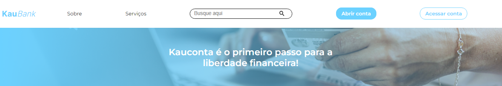
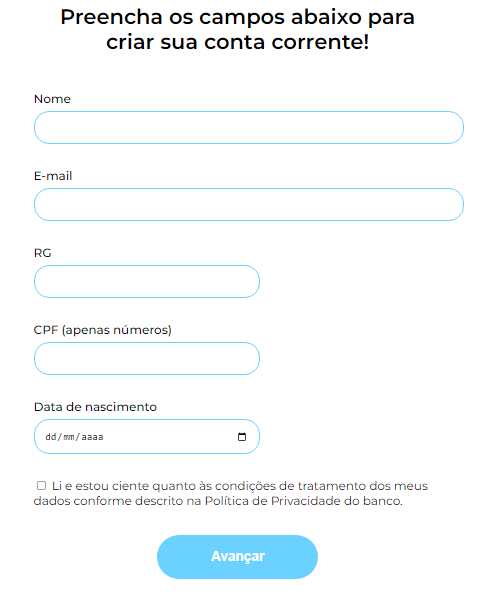
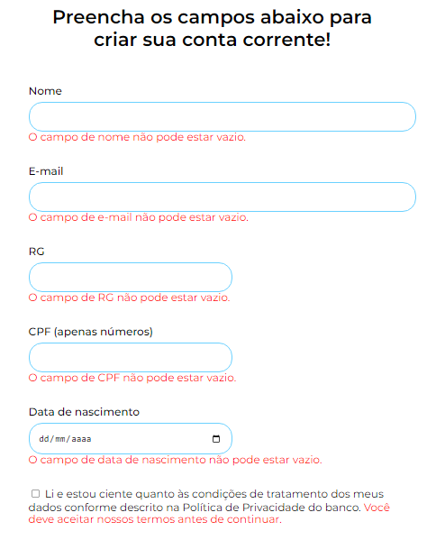
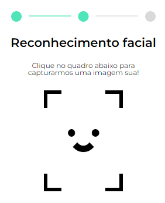
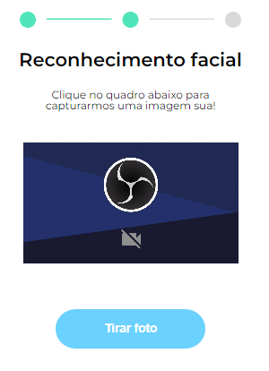

  

## 
Formulário de criação de contas para o banco virtual KauBank.

### Projeto com criação de formulário com todas as suas validações obrigatórias, utilizando recursos do HTML para realizar as validações ou criando funções Javscript para conferir se os dados inseridos pelo usuário são validos

## Formulário e suas mensagens de erro caso input esteja inválido

 

 

## Reconhecimento Facial 

 

 

## Etapa finalizada

 

## Tecnologias utilizadas durante o curso 🛠
* JavaScript
* HTML
* CSS

